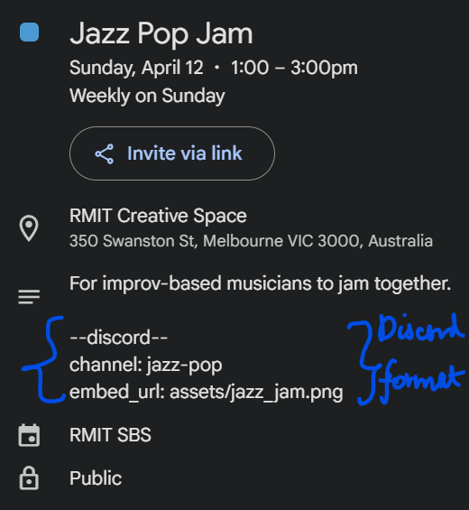
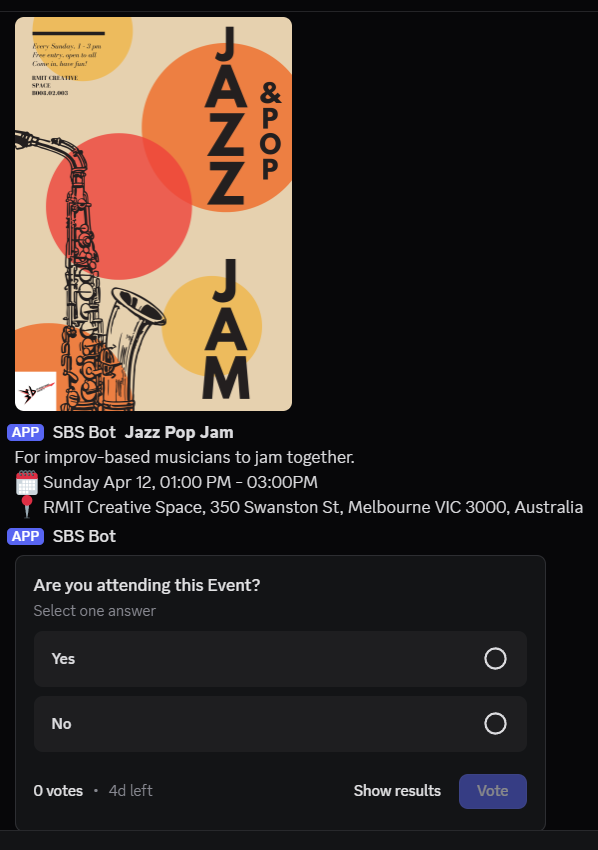

# 🎵 RMIT SBS Club Bot

This bot is designed to support the operations of the Student Band Society, an RMIT-based music club.

---

## ✨ Key Features

## 🗓️ 1. Google Calendar-Driven Event Polls and Alerts

The bot integrates with the SBS Google Calendar to help coordinate club events automatically. Here's what it aims to solve:
- **Customizable jam events:** Customized weekly jams or one-off events like gigs or workshops can be added by creating a recurring or one-off Google Calendar event.
- **Easy to change plans:** If a jam time, location, or details change, just update the calendar — the bot will reflect those changes automatically
- **Cancelling is simple:** Removing an event from the calendar automatically stops any reminders from being sent. This is useful during holiday or break periods.

### Creating Discord Event posts

You can convert a Calendar Event to a Discord Post. See below for an example:
<table border="0">
  <tr>
    <td align="center">
      <br>
      <sub><b>Google Calendar Event Setup</b></sub>
    </td>
    <td align="center">
      <br>
      <sub><b>Discord Event Reminder Post</b></sub>
    </td>
  </tr>
</table>

Steps to convert a Google Calendar Event to Discord Event Post, add the **"Discord Format"** text below to the Calendar Event description.
```
--discord--
channel: {which discord channel should the bot post to}
embed_url: {url of the event image}
```
See screenshots for an example.


Each Discord Event post can pull the following from the Calendar Event:
- Title
- Description
- Start and End Time
- Location
- Event picture
- An Yes/No attendance poll

The bot will post it to the specified channel **7 days before the event** so members have time to fill the poll.

### Discord Event Detection
The bot regularly syncs with the club calendar for upcoming events and event updates marked for Discord posting.

### Handling Calendar Updates
Until the Discord Event is posted, The bot can handle calendar event updates such as:
- Cancellations
- updates to its details, such as title, location etc. 

Note that after posting, any updates will not trigger a repost. This is to avoid duplicate announcements for the same event.

### Recurring Event Support
For recurring calendar events, the **earliest** upcoming event is posted.

---

## 🗳️ 2. Card Holder Polls and Follow-Up Alerts

The bot handles a weekly cycle of automated polls and follow-up alerts to help coordinate access to the club space.

### Weekly Card Holder Availability Poll
Every **Monday at 12 PM**, a poll is posted in the `card-holders` channel asking card holders when they are available to open the space for:
- **Saturday**
- **Sunday**

A follow-up message also includes a link to the Bookings Calendar so card holders can check the required opening time.

### Thursday Availability Alert
On **Thursday at 6 PM**, if nobody has voted for one or more days, the bot sends an alert in the `card-holders` channel to prompt a response.

### Friday Jam Session Warnings
On **Friday at 8 PM**, if a day still has no available card holder, the bot sends a warning to the relevant jam channels so members know that the space may not be available.

---

## ℹ️ 3. Jam Commands

The bot also includes jam-related commands for sharing useful club information.

The `!jam_info` command sends a helpful explanation of how jam sessions work, along with useful links such as:
- The Creative Space location
- The shared Jam Songs spreadsheet

The `!jam_songs <sheet_name> <song_amount>` command lists songs from the selected sheet, such as `Jazz`, `Rock`, or `Pop`, using data from the shared Jam Songs spreadsheet.

---

## 🛠️ 4. Admin / Testing Commands

To make testing and manual control easier, the bot includes admin-only commands for triggering the card holder workflow manually:

- `!committeepoll`
- `!cardalert1`
- `!cardalert2`

These are useful for testing bot behaviour without waiting for the scheduled times.

---

## 🛠 Deployment

This bot is hosted 24/7 using a shady bot hosting service. But hey, it's cheap.
